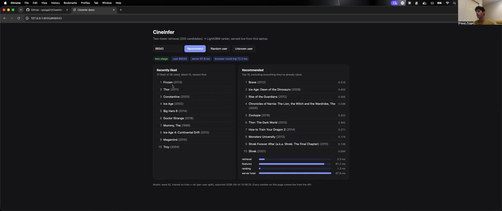

<!-- Generated by scripts/write_readme.py from README.template.md and results/*.csv.
     Edit the template, then run `make readme`. `make readme-check` (also in CI) fails
     if this file and the results disagree. -->
# CineInfer

**A movie recommender: tell it who you are, and it suggests 10 movies you're likely to love.**

It learned from 25,000,095 real movie ratings (the public MovieLens dataset: 162,541
people rating 62,423 movies) and picks its suggestions from all 62,423 movies.

### Demo video (7 min)

[](docs/cineinfer-demo.mp4)

*Click the image to watch the walkthrough: the live demo page, the results, and how it was built.*

This README is written for anyone, no machine-learning background needed. The technical details
are in the [appendix](#appendix-technical-details) at the end. Every number in this README is
filled in automatically from the project's result files, so none of them were typed by hand.

---

## How well does it work?

To test it fairly, each person's **most recent** ratings were hidden from the system while it was
built. At the end, it made 10 suggestions for each of 153,995 people, and we checked how
many matched movies they **actually went on to love** (rated 4 or 5 stars). This final test was
run **once**, so it couldn't be tuned to look good.

| Method | Out of 100 users, how many got at least one movie they loved | Loved movies per 10 recommendations |
|---|---|---|
| **CineInfer (the final system)** | 54 | 1.0 |
| Neural network only (no ranker) | 47 | 0.8 |
| EASE (best traditional method) | 45 | 0.7 |
| ALS (traditional) | 43 | 0.7 |
| "People who liked X also liked Y" | 36 | 0.6 |
| Just recommend popular movies | 22 | 0.3 |

**In plain words:**
- Out of every 100 people, about **54** found at least one movie they'd go
  on to love in their top 10.
- That's **3.0× more good suggestions** than just recommending
  popular movies, and **1.3× more** than the best traditional method.
- "About 1 good movie in 10" may sound low, but the test is strict: the typical person loved only
  about **4** movies in their hidden period, out of 62,423. Guessing
  at random would find almost none. And a "miss" isn't necessarily a bad suggestion: it only means
  they didn't happen to rate that movie in the test period.

---

## How it works, in plain words

**1. Learn from the past, test on the future.** Each person's ratings are sorted by date. The
older ones are used for learning, and the newest ones are hidden and only used for the final
test, the way a teacher keeps exam questions secret. Automated checks make sure no "future"
ratings ever leak into the learning part.

**2. Start with simple methods as a benchmark.** Before anything complex, several traditional
methods were built, from "recommend whatever is popular" to "people who liked X also liked Y".
The complex system only counts if it beats the best of these.

**3. A neural network quickly finds 200 candidates.** It places every movie on a kind of "map"
where movies liked by the same people sit close together. It then places you on that map based on
your 10 most recently liked movies, and grabs the 200 movies closest to you, out of
62,423, in about a millisecond.

**4. A second model carefully picks the final 10.** It looks more closely at those 200, using extra
information: how popular and well-rated each movie is, whether its genres match your taste, and
a second opinion from the best traditional method. It re-orders them and keeps the top 10. This
"quick search, then careful choice" design is common in large recommendation apps.

**5. A fast web service.** You (or an app) ask for a person's suggestions and get them back in a
few thousandths of a second. New users with no history get a list of popular movies instead.

---

## What we learned

- **The two-step design pays off.** The careful second step improved results by
  +21.2% over the neural network alone.
- **Much of the success comes from people rating in bursts.** MovieLens records when someone
  *rated* a movie, not when they watched it, and people often rate many movies in one sitting:
  70.7% of people rated all of their hidden movies within one hour. So the system is
  often predicting "what will you rate next tonight". It still does better than the traditional
  methods for people who come back later, but by less.
- **How you split the data changes the score a lot.** Testing with randomly shuffled ratings
  instead of by date made the same method score **2.27×** higher, an overly rosy
  picture. That's why everything here is tested on each person's most recent ratings.
- **Simpler tools were faster for the data preparation.** Preparing all 25,000,095 ratings
  took **1.5 seconds** with DuckDB, 15.6 seconds with Spark
  (a tool built for many computers), and 34.9 seconds with pandas.

---

## Predictions made before building the neural network

Before training any neural network, I wrote down seven predictions and saved
them publicly on GitHub with a timestamp, so they couldn't be quietly changed afterwards.
Five turned out wrong, and they're all reported:

| # | Prediction (in plain words) | Result |
|---|---|---|
| 1 | The neural network beats "recommend popular movies" by at least 50% | ✅ right |
| 2 | A well-tuned traditional method nearly matches the neural network | ❌ wrong: the neural network was clearly better |
| 3 | The careful second step adds only a little | ❌ wrong: it added +21.2% |
| 4 | "Recommend popular movies" covers the fewest different movies | ✅ right |
| 5 | pandas is faster than Spark at every data size | ❌ wrong: Spark was faster at the largest size |
| 6 | Suggestions come back in under 25 ms, even in the slowest 1% of cases | ❌ wrong: the slowest 1% took 28.5 ms |
| 7 | Testing on shuffled data inflates scores by at least 50%, and three test setups score in a predicted order | ❌ wrong: the inflation was real (2.27×), but the order was wrong |

The exact wording and evidence for each are in the [appendix](#predictions-full-detail).

---

## Try it yourself

You'll need a Mac or Linux computer, Python 3.11 and Java 17 (on a Mac, also run
`brew install libomp`), plus about 15 GB of free disk space. The movie data is downloaded
automatically; it isn't stored in this repository, because its license doesn't allow sharing it.

```bash
make install      # set up everything
make test         # run the automated checks (no download needed)
make data         # download the movie ratings (and check they're not corrupted)
make prep         # prepare the data (~2 minutes)
```

The models themselves aren't stored in the repository either, so they have to be trained before
the recommender can run. That takes several hours on a laptop; the full list of commands is in the
[appendix](#running-everything). Once they're built, `make export serve` starts the recommender,
and the demo page at `http://localhost:8000` lets you pick any user (or a random or brand-new one)
and see the movies they recently liked next to the 10 suggestions, with how long each step took.

---

## Limitations

- **Tested on past data only.** The system was never shown to real users, so we don't know how
  people would actually respond to its suggestions.
- **Rating isn't watching.** People rate movies in bursts, which makes some predictions easier
  than they would be in a real app (see "What we learned").
- **Every MovieLens user has at least 20 ratings,** so the "new user" path is built and tested but
  never met a genuinely new person. 7,852 movies were rated only in the hidden
  periods, so the system never saw them and could never suggest them.
- **Some information about other people's future ratings** is available to the system during
  learning (for example, how popular a movie *eventually* became). A follow-up experiment showed
  that removing this doesn't hurt (see the appendix).
- **It all ran on one laptop,** and the results are specific to movies and MovieLens.

---

## Glossary

| Term | Meaning |
|---|---|
| **Recommender** | a system that suggests items (movies, songs, products) a person might like |
| **Neural network** | a program with millions of adjustable numbers that it tunes by learning from examples |
| **Traditional methods** (EASE, ALS, item-kNN) | older, well-established recommendation techniques, mostly formula-based |
| **Ranker** | the second step that re-orders candidates to put the best ones on top (here, LightGBM, a model made of many small decision trees) |
| **Training / validation / test** | learning data / practice exam used to make decisions / final exam taken once |
| **NDCG@10** | a 0-to-1 score for a top-10 list: higher when movies the person loved appear, and higher still when they appear near the top |
| **ms (millisecond)** | one thousandth of a second |

---

## Appendix: technical details

### Results on the test set (scored once)

153,995 users, each ranking against the full catalog with everything they'd already rated
masked. A movie counts as relevant if the user rated it ≥ 4 in their held-out test period.

| Model | NDCG@10 | Recall@10 (capped) | AUC | Coverage | Runs |
|---|---|---|---|---|---|
| **Two-stage (headline)** | 0.1679 | 0.2028 | 0.989 | 11.4% | 3 (median) |
| Two-tower (retrieval) | 0.1382 | 0.1723 | 0.989 | 16.4% | 3 (median) |
| EASE | 0.1211 | 0.1482 | 0.976 | 5.7% | deterministic |
| EASE, recent-10 input (control) | 0.1184 | 0.1463 | 0.965 | 7.4% | deterministic |
| Implicit ALS | 0.1165 | 0.1429 | 0.948 | 5.3% | 3 (median) |
| Item-kNN | 0.0956 | 0.1168 | 0.984 | 7.3% | deterministic |
| Most-popular | 0.0513 | 0.0617 | 0.977 | 0.6% | deterministic |

- **The two-stage system beats every baseline**: +38.5% NDCG@10 over
  EASE (+0.0466, 95% CI [+0.0458, +0.0475], paired bootstrap
  over users), and 3.3× most-popular.
- **The ranker adds +21.2%** over retrieval alone
  (+0.0294, CI [+0.0288, +0.0299]). It can only
  re-order what retrieval found: 64.6% of relevant test movies are in the
  200 candidates.
- **The two-tower model beats EASE by +14.3%**
  (+0.0173, CI [+0.0162, +0.0183]) and recommends
  2.9× as much of the catalog (16.4% vs
  5.7% of the 55,119 movies with training data).
- Paired bootstrap on NDCG@10, Two-stage (headline) > Two-tower (retrieval) > EASE > Implicit ALS > Item-kNN > Most-popular: every step is statistically clear (`results/test_gaps.csv`).

### Where the gains come from (session boundary)

70.7% of users rated their whole test slice within one hour (median span
4 minutes). Test results by the gap between a user's last training rating
and their first test rating:

| Test NDCG@10 by gap between last train/val rating and first test rating | same second (27,032 users) | within 1 h (119,046 users) | over 1 h (7,917 users) | all (153,995 users) |
|---|---|---|---|---|
| EASE | 0.1359 | 0.1176 | 0.1242 | 0.1211 |
| EASE, recent-10 input (control) | 0.1528 | 0.1113 | 0.1074 | 0.1184 |
| Two-tower (retrieval) | 0.2004 | 0.1271 | 0.0980 | 0.1384 |
| **Two-stage (headline)** | 0.2283 | 0.1563 | 0.1339 | 0.1678 |

The two-tower model uses only a user's last 10 liked movies, so it's strongest within a session
(0.2004 vs EASE's 0.1359) and **worse than EASE
when the test period starts more than an hour later** (0.0980 vs
0.1242). Feeding EASE only the last 10 movies (the control row) doesn't
reproduce that. The ranker sees both scores, so the two-stage system beats EASE in every bucket,
including over 1 h (0.1339).

### Ranker ablations

| System (test) | NDCG@10 | vs headline (95% CI) |
|---|---|---|
| Two-stage + time features (ablation, not used) | 0.1745 | +0.0063 [+0.0061, +0.0065] |
| **Two-stage (headline)** | 0.1679 | — |
| Two-stage without EASE features (ablation) | 0.1480 | -0.0200 [-0.0204, -0.0195] |
| Two-tower (retrieval) | 0.1382 | -0.0294 [-0.0299, -0.0288] |

- **EASE's score is the ranker's most valuable feature.** Without it the ranker keeps only
  33% of its gain over retrieval.
- **Two time features are excluded** even though they help: they compare a user's last rating with
  the last time *anyone* rated a movie, which under a per-user split includes other users' ratings
  from after this user's cutoff.

### Removing the cross-user time leak (validation, after the fact)

A follow-up rebuilt the ranker's item features **point in time**: only ratings made strictly before
the user's last training rating, by anyone (`make pit-experiment`). The recomputed headline
reproduces Phase 6 exactly for every seed:

| Ranker features (validation, 3 seeds) | NDCG@10 | vs headline (95% CI) |
|---|---|---|
| Headline (full-train item stats) | 0.1784 | — |
| Point-in-time item stats | 0.1822 | +0.0038 [+0.0035, +0.0040] |
| Point-in-time item stats + point-in-time recency | 0.1829 | +0.0045 [+0.0043, +0.0048] |

The leak wasn't propping the headline up: point-in-time popularity is *more* informative. This was
designed after the test results were known, so it's reported on validation only.

### Predictions, full detail

2 of 7 confirmed, 5 refuted. Each
had a "refuted if" condition, was committed, tagged
([`predictions`](https://github.com/spoigai21/cine-infer/tree/predictions)) and pushed before any
neural model existed, and is settled by code from the result files.

| # | Prediction (committed before training) | Verdict | Evidence |
|---|---|---|---|
| 1 | Two-tower beats most-popular on NDCG@10 by at least 50% (relative). | ✅ confirmed | two_tower/most_popular NDCG@10 = 2.694 (needs >= 1.5) |
| 2 | EASE matches or beats two-tower on Recall@10; two-tower within 10% of EASE. | ❌ refuted | (EASE - two_tower)/EASE Recall@10 = -0.163; two_tower - EASE = +0.0244 [+0.0230, +0.0256] |
| 3 | Ranking stage changes NDCG@10 over retrieval alone by -1% to +5% (relative); refuted if > +5% or significantly below -1%. | ❌ refuted | (two_stage - two_tower)/two_tower NDCG@10 = +0.215; diff +0.0293 [+0.0288, +0.0299] |
| 4 | Most-popular has the lowest catalog coverage of all models. | ✅ confirmed | most_popular 0.0059 vs lowest other 0.0530 (implicit_als) |
| 5 | pandas beats PySpark on the Phase 1 feature pipeline at 1M, 5M and 25M rows, with and without Spark startup: no crossover. | ❌ refuted | 1M with startup: pandas 0.80s vs spark 7.10s; 1M without startup: pandas 0.51s vs spark 2.08s; 5M with startup: pandas 3.44s vs spark 8.46s; 5M without startup: pandas 3.11s vs spark 3.32s; 25M with startup: pandas 34.93s vs spark 15.59s; 25M without startup: pandas 35.57s vs spark 8.95s |
| 6 | Serving p99 < 25 ms and p50 < 10 ms for top-10 (two-tower + ranker, 1,000 sequential HTTP requests after 50 warm-up). | ❌ refuted | two-stage client p50 5.23 ms (needs < 10), p99 28.51 ms (needs < 25); 1,000 sequential HTTP requests after 50 warm-up, power AC |
| 7 | Random split overstates NDCG@10 vs the global cutoff by at least 50%; ordering random > per-user > global (EASE). | ❌ refuted | EASE test NDCG@10: random 0.3359, per-user 0.1211, global 0.1482; random/global = 2.27 (95% CI 2.17-2.37; needs >= 1.5); order random > global > user |

- **#2, #3:** a well-tuned EASE didn't match the neural model, and the ranker added far more than
  expected; much of the two-tower's gain comes from predicting the rest of a rating session.
- **#5:** local-mode Spark's overhead dominates at 1M and 5M rows, but single-threaded pandas scales
  worse, and Spark wins at 25M. DuckDB and Polars beat both at every size.
- **#6:** p50 was fast, but p99 missed by 3.5 ms.
- **#7:** the random split inflates NDCG@10 more than predicted, but the global cutoff scored
  *above* the per-user split: its 3,992 test users are heavy raters still active
  after January 2018, a different population.

### How the split choice changes the numbers

| Split (EASE, same config) | Test users | NDCG@10 (95% CI) | × global |
|---|---|---|---|
| Random 80/10/10 | 148,766 | 0.3359 (0.3345–0.3373) | 2.27 |
| Per-user time split (the project's) | 153,995 | 0.1211 (0.1202–0.1221) | 0.82 |
| Global time cutoff | 3,992 | 0.1482 (0.1415–0.1547) | 1.00 |

A random split reports 2.27× (95% CI 2.17–2.37) the global cutoff's NDCG@10.
The per-user time split keeps 153,995 users evaluable (the global cutoff keeps
3,992) with no user's own future in their training data.

### Serving

`GET /recommend/{user_id}?k=10` retrieves 200 candidates by brute-force dot product over all
62,423 movies, builds 15 features, ranks with LightGBM and returns titles, scores and
per-stage timings. The server is NumPy + LightGBM only (no PyTorch) and loads in
2 s.

- **No training/serving skew:** on 2,000 test users, the server's top-10 matches the
  batch pipeline's for 100%.
- **Latency (1,000 sequential HTTP requests, laptop CPU):** the run that settled
  prediction #6 measured p50 5.2 ms and p99 28.5 ms. Afterwards,
  single-threaded serving gave p50 3.2 ms and p99
  6.8–19.3 ms (default threading: p99 25–60 ms). The
  popularity fallback takes 0.4 ms.

### Retraining with Airflow

An Airflow DAG runs prep → train → evaluate → **publish only if better**: validation NDCG@10 must
beat the live model by more than 0.003 (just above measured run-to-run noise).
Publishing refits on train + val, rebuilds the ranker, exports and smoke-tests a bundle, then swaps
it in atomically. A deliberately worse 1-epoch model (0.1396 vs
0.1538) was rejected; in a sandbox, a better one (0.1526 vs
0.1396) was published end to end. MovieLens is a fixed dataset, so this pipeline
retrains on the same data; a live deployment would add a step that pulls new ratings.

### Data-tool benchmark

The data-preparation pipeline in four tools with identical outputs (36 runs, AC power,
load ≤ 3.0). Each cell is *with startup / without startup*, median of 3:

| Rows | pandas | Spark (6 cores) | Polars | DuckDB |
|---|---|---|---|---|
| 1,000,379 | 0.80 / 0.51 s | 7.10 / 2.08 s | 0.24 / 0.08 s | 0.13 / 0.10 s |
| 5,001,313 | 3.44 / 3.11 s | 8.46 / 3.33 s | 0.50 / 0.37 s | 0.39 / 0.33 s |
| 25,000,095 | 34.93 / 35.57 s | 15.59 / 8.95 s | 2.61 / 1.98 s | 1.50 / 1.50 s |


### Tuning

All choices were made on 151,597 validation users; the test set was never used for any
decision.

| Model | Validation NDCG@10 | Chosen config | Trials | Tuning time |
|---|---|---|---|---|
| Most-popular | 0.0528 | — | 1 | 2 s |
| Item-kNN | 0.0976 | k=200, min_pos=20, shrink=0.0 | 8 | 42 s |
| EASE | 0.1193 | lam=1000.0, min_pos=20 | 12 | 4 min |
| Implicit ALS | 0.1153 | alpha=1.0, rank=256, reg=0.1 | 19 | 1.4 h |
| EASE, recent-10 input (control) | 0.1224 | lam=4000.0, min_pos=20, recent_n=10 | 14 | 2 min |
| Two-tower (retrieval) | 0.1531 | dim=256, epochs=6, hist_len=10, lr=0.009, pairs_per_user=100, tau=0.05 | 19 | 2.7 h |
| **Two-stage (headline)** | 0.1784 | learning_rate=0.02, min_data_in_leaf=6, num_leaves=63, rounds=123 | 10 | 4 min |

### Running everything

```bash
make install        # .venv with everything
make data           # download + verify MovieLens 25M (not redistributable, never committed)
make prep           # Phase 1: splits + features (~2 min)
make baselines      # Phase 3: tune the baselines on validation (~1.5 h, mostly ALS)
make two-tower      # Phase 5: tune the retriever (~3 h on an Apple GPU)
make ranker         # Phase 6: two-stage system on validation (~45 min)
make final-test     # Phase 6b: refit everything, score test once (~1.5 h)
make export serve   # Phase 7: build the serving bundle, run the API + demo page on :8000
make airflow-install airflow-reject-demo   # Phase 8: a worse model is refused
make airflow-publish-demo   # Phase 8: the publish path, end to end, in a sandbox registry
make airflow-ui     # Airflow UI on :8080 (user admin; password in airflow_home/standalone_admin_password.txt)
make benchmark      # Phase 9 (plug in, idle machine)
make split-comparison test-analysis readme  # Phase 10
make pit-experiment # follow-up: point-in-time ranker features (validation only)
make test           # the test suite, on a synthetic fixture (also in CI)
```

Times are rough guides for one laptop. Run one pipeline at a time.

### Repository map

`src/` pipeline code · `tests/` pytest on a synthetic fixture · `results/` every number in this
README, as CSV · `dags/` Airflow · `cineinfer.md` the plan and predictions ·
`cineinfer-implementation.md` the build log, phase by phase. Data:
[MovieLens 25M](https://grouplens.org/datasets/movielens/25m/) (GroupLens; downloaded by
`make data`, not redistributed).
